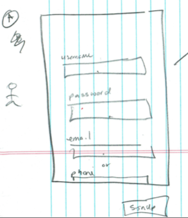
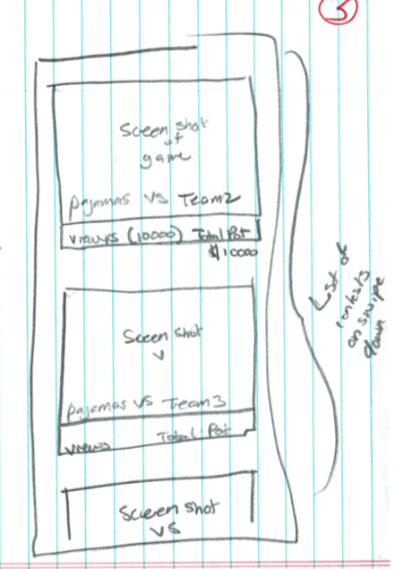
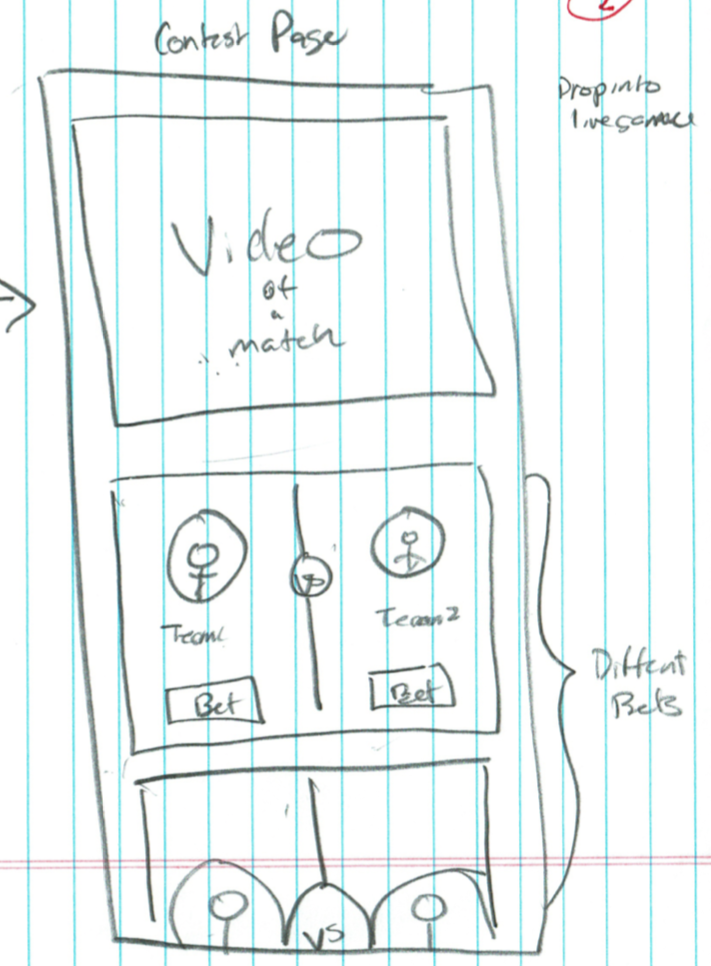
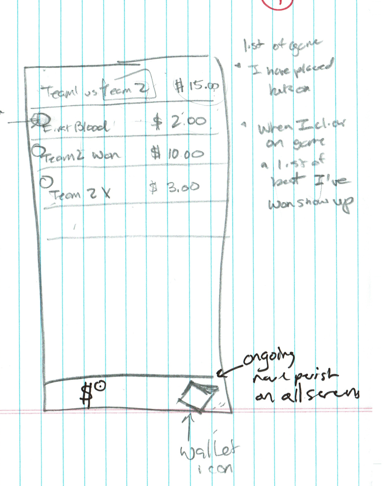

# Documentation
Full API documentation can be found [here](http://gglol-docs.s3-website-us-west-1.amazonaws.com/)

# Technology
1. MongoDB - https://cloud.mongodb.com  (Free Tier - Stage)
1. AWS - Lambda (APIs & Schedule Jobs)
1. AWS - SES (Email Service)
1. AWS - SNS (Push Service)
1. NodeJS - 8.X
1. Travis-CI - CD/CI

# Architecture

## AWS
As noted above 99% of our infra is hosted in AWS for cost savings. 
We use lambdas to run our APIS and scheduled jobs and use SNS and SES to communicate with the users via email and push notifications.
Future thoughts are to use SNS for an event based architecture.

## Access
If you need access please ping Armadno Padilla

## MongoDB 
Our MongoDB instance is hosted by MongoDB Atlas.
https://cloud.mongodb.com

## Environments
1. Prod - Production instance. (Will exist before we go to live)
1. Stage - Used for testing before release

## Access
To gain acces please ping Armando Padilla

#Deployment

## Local Deployment

## Production Deployment
No production deployments are allows outside of our CD/CI pipeline. 

## Access
If you need access to Travis-CI please ping Armando Padilla

## CI
https://travis-ci.org/Wiredpanda/phoenix-apis

## Documentation
1. Create an S3 bucket. 
1. Convert S3 bucket to Web Hosted Bucket
1. Download [Swagger-UI](https://github.com/swagger-api/swagger-ui/releases) 
1. Upload the `dist` into S3 bucket.
1. Load the S3 bucket on a browser.
1. The Documentation URL will be provided when you push the code to lambda. Within the Travis-CI console.

# System Documentation
Some general pointers about different services in the system.

# Bet
1. User submits a bet
1. Fetch all my bets
1. Fetch all bets on a video
1. Issue out winning
1. Tie mechanics
1. Other…

# Notifications
Will not be triggered by a API call

# Event Logger
1. GET - /event/list - Fetch all the events - Some searching
1. No deleting

# Schedule Hooks
1. Every 5 minutes run and lock contests within X minutes from ending.

# General Hooks
1. On complete game issue out the winnings

# General Flow
Place the user flow designs here.  Outline how the FE works with the BE to do specific things

## Sign Up
### Overview
Sign up page allows users...well...to sign up.  User must supply username, password, and an email or phone number.

### Screen

### API To Use
Account - POST /account (see API docs above)

## Contest List
### Overview
List of contests the user can join/watch

### Screen

### API To Use
Contest - GET /contest/list (see API docs above)

## Contest
### Overview
Contest Page. Contains detailed info of a contest. Bets, match info. etc.

### Screen

### API To Use
Contest - GET /contest/{contestId} (see API docs above)

## My Contests
### Overview
List of contests a specific user is in.

### Screen

### API To Use
Contest - GET /contest/my-contests (see API docs above)

# To Do

1. Stripe integration
    1. Deposit
    1. Escrow Deposit - Contest, user enters contest
    1. Withdraw
    1. Escrow Withdraw - Contest, user leaves
    1. Create account - User
    1. Escrow Create account - Contest (holds the money for the contest)
1. Fetch game state - API integraiton with X service
1. Issue out pot

## Backlog
1. Update Game - a bunch of questions to answer but not show stoppers.
1. Delete Game - a bunch of questions but not show stopper.
1. Leave a contest - what happens when they leave?
1. Admin
1. Hook up event logger